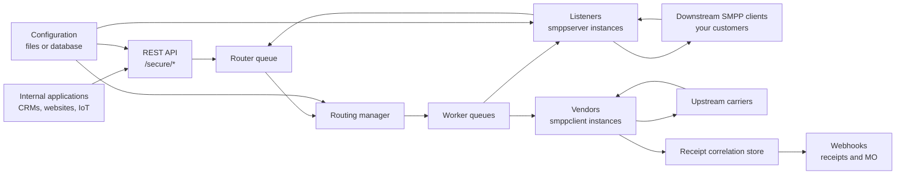
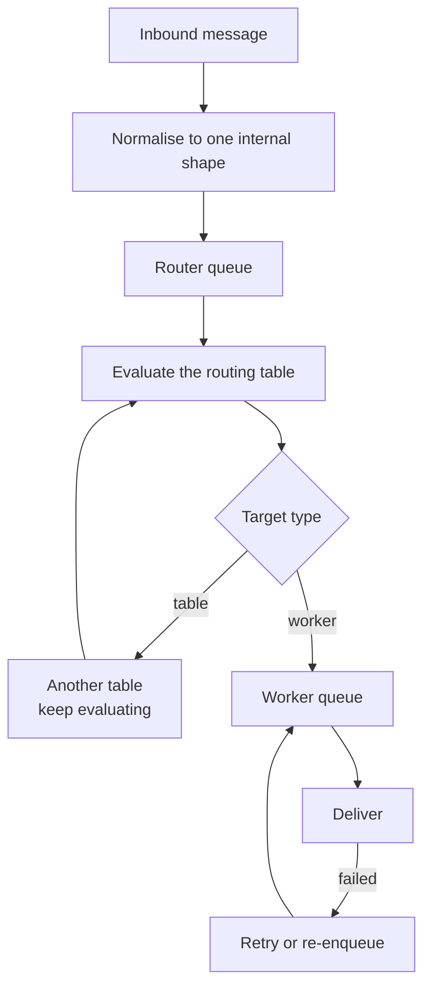

FireFlo acepta mensajes salientes desde HTTP o desde clientes SMPP descendentes, los normaliza a una
única forma interna, los enruta a través de tablas configurables y los entrega mediante conexiones de
proveedor a los operadores ascendentes.

## Los dos módulos

| Módulo | Contiene |
| :--- | :--- |
| `fireflo-app` | La aplicación Quarkus ejecutable, el punto de entrada de Docker, las propiedades de la aplicación, el empaquetado |
| `fireflo-core` | La pasarela: REST API, listeners, vendors, enrutamiento, colas, seguimiento de acuses, configuración, webhooks |

## Componentes en tiempo de ejecución

## La tubería

Los protocolos entrantes crean un mensaje interno y lo encolan. Los hilos del enrutador evalúan la
tabla de enrutamiento y encolan en una o más colas de trabajadores. Los hilos de trabajador realizan
la entrega específica del protocolo.

<Warning>
**Un mensaje se acepta, se cobra y se responde antes de que se enrute.** Eso es lo que hace rápida a
la pasarela, y por eso importan las colas: todo lo que hay en ellas ya se ha pagado. Sin límite, un
proveedor que deja de aceptar más un listener que sigue aceptando hace crecer el heap hasta que la JVM
es eliminada. Y cada mensaje encolado muere sin reembolso y queda registrado como nada más que PENDING.

Los [límites de cola](/reference/config/limits) son la forma de acotar eso, y deliberadamente no hay
valor por defecto.
</Warning>

## Dónde vive el estado

| Estado | Vive en | Sobrevive a un reinicio |
| :--- | :--- | :--- |
| Configuración | Archivos, o PostgreSQL | Sí |
| Registros de llamada | PostgreSQL, o `data/cdr/` | Sí |
| Saldo prepago y libro mayor | Solo PostgreSQL | Sí |
| Correlación de acuses, acuses retenidos | `data/dlr-mvstore.db` | Sí |
| Colas, bloques de crédito reservado, estado de sesión | Memoria | **No** |

Dos de esos vale la pena conocerlos con precisión:

**El almacén de acuses es el único estado persistente fuera de PostgreSQL.** Recuerda qué id de
mensaje del proveedor pertenece a qué envío, y guarda los acuses de un cliente que se ha desconectado.
Consulte [los ajustes del almacén](/reference/config/webhooks).

**El crédito reservado está en memoria.** El crédito se entrega a un trabajador en bloques y se gasta
desde un contador, por lo que no hay escritura en base de datos en la ruta del mensaje. Un apagado
limpio devuelve lo no gastado; un `kill -9` lo deja varado hasta que se ejecuta
[`fireflo credit release`](/reference/cli/fireflo). `balance + reserved` se conserva de cualquier
forma.

## Ambas direcciones

FireFlo no es solo una pasarela saliente.

| Dirección | Ruta |
| :--- | :--- |
| **MT saliente** | Cliente → listener o REST → enrutador → vendor → operador |
| **MT entrante por HTTP** | Aplicación → `/secure/send` → el mismo enrutador |
| **Acuses de vuelta** | Operador → vendor → almacén de correlación → sesión del cliente, o su webhook |
| **MO entrante** | Operador → vendor → resolución de propietario → sesión del cliente, o su webhook |

La propiedad de un mensaje entrante se resuelve mediante `mo.owner.map` en el listener, y un mensaje
sin mapear no va a **ninguna parte** en lugar de a una suposición. Consulte
[los ajustes del listener](/reference/smpp/server).

## Qué no está en la ruta del mensaje

El **panel de control**. Edita la configuración y lee los registros de llamada; un panel caído le
cuesta la capacidad de hacer cambios, no la capacidad de enviar.

El **puerto de gestión** (9000). La salud, las métricas y los verbos de control viven ahí, apartados
del puerto que lleva los mensajes, detrás de [dos tokens separados](/reference/config/operational-endpoint).
