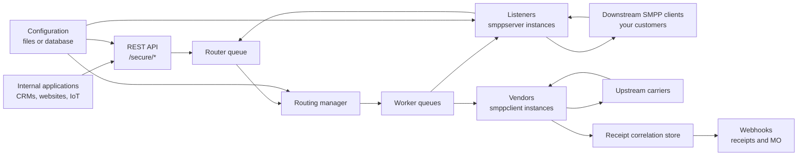
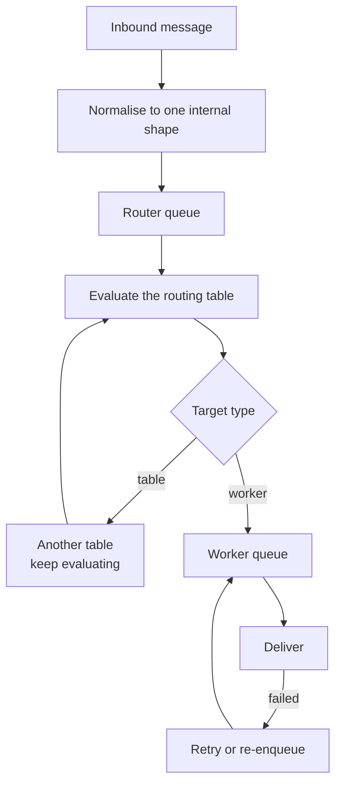

FireFlo accepte les messages sortants depuis HTTP ou depuis les clients SMPP en aval, les normalise
dans une seule forme interne, les route à travers des tables configurables, et les livre via des
connexions vendor vers les opérateurs en amont.

## Les deux modules

| Module | Contient |
| :--- | :--- |
| `fireflo-app` | L'application Quarkus exécutable, le point d'entrée Docker, les propriétés d'application, l'empaquetage |
| `fireflo-core` | Le gateway : API REST, listeners, vendors, routage, files d'attente, suivi des accusés, configuration, webhooks |

## Composants d'exécution

## Le pipeline

Les protocoles entrants créent un seul message interne et le placent en file d'attente. Les threads
du routeur évaluent la table de routage et placent le message dans une ou plusieurs files d'attente
de workers. Les threads workers effectuent la livraison spécifique au protocole.

<Warning>
**Un message est accepté, facturé et acquitté avant d'être routé.** C'est ce qui rend le gateway
rapide, et c'est pourquoi les files d'attente comptent : tout ce qui s'y trouve a déjà été payé.
Sans limite, un vendor qui cesse d'accepter combiné à un listener qui continue d'accepter fait
grossir le tas jusqu'à ce que la JVM soit tuée. Chaque message en file meurt sans remboursement et
n'est enregistré que comme PENDING.

Les [limites de files d'attente](/reference/config/limits) sont la manière de borner cela, et il n'y
a délibérément aucune valeur par défaut.
</Warning>

## Où vit l'état

| État | Vit dans | Survit à un redémarrage |
| :--- | :--- | :--- |
| Configuration | Fichiers, ou PostgreSQL | Oui |
| Enregistrements d'appels | PostgreSQL, ou `data/cdr/` | Oui |
| Solde prépayé et grand livre | PostgreSQL uniquement | Oui |
| Corrélation des accusés, accusés retenus | `data/dlr-mvstore.db` | Oui |
| Files d'attente, blocs de crédit réservé, état de session | Mémoire | **Non** |

Deux d'entre eux méritent d'être connus avec précision :

**Le magasin d'accusés est le seul état persistant en dehors de PostgreSQL.** Il retient quel
identifiant de message vendor appartient à quelle soumission, et conserve les accusés d'un client qui
s'est déconnecté. Voir [les paramètres du magasin](/reference/config/webhooks).

**Le crédit réservé est en mémoire.** Le crédit est distribué à un worker par blocs et dépensé depuis
un compteur, donc il n'y a pas d'écriture en base sur le chemin du message. Un arrêt propre restitue
ce qui n'est pas dépensé ; un `kill -9` le bloque jusqu'à ce que
[`fireflo credit release`](/reference/cli/fireflo) s'exécute. `balance + reserved` est conservé dans
les deux cas.

## Les deux directions

FireFlo n'est pas seulement un gateway sortant.

| Direction | Chemin |
| :--- | :--- |
| **MT sortant** | Client → listener ou REST → routeur → vendor → opérateur |
| **MT entrant via HTTP** | Application → `/secure/send` → le même routeur |
| **Accusés retour** | Opérateur → vendor → magasin de corrélation → session du client, ou son webhook |
| **MO entrant** | Opérateur → vendor → résolution du propriétaire → session du client, ou son webhook |

Le propriétaire d'un message entrant est résolu par `mo.owner.map` sur le listener, et un message non
mappé ne va **nulle part** plutôt que vers une supposition. Voir
[Paramètres du listener](/reference/smpp/server).

## Ce qui n'est pas sur le chemin du message

Le **panneau de contrôle**. Il édite la configuration et lit les enregistrements d'appels ; un
panneau hors service vous coûte la capacité d'effectuer des changements, pas la capacité d'envoyer.

Le **port de gestion** (9000). La santé, les métriques et les verbes de contrôle y vivent, à l'écart
du port transportant les messages, derrière [deux tokens distincts](/reference/config/operational-endpoint).
