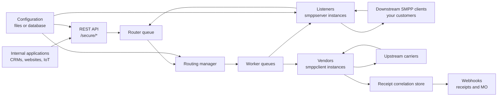
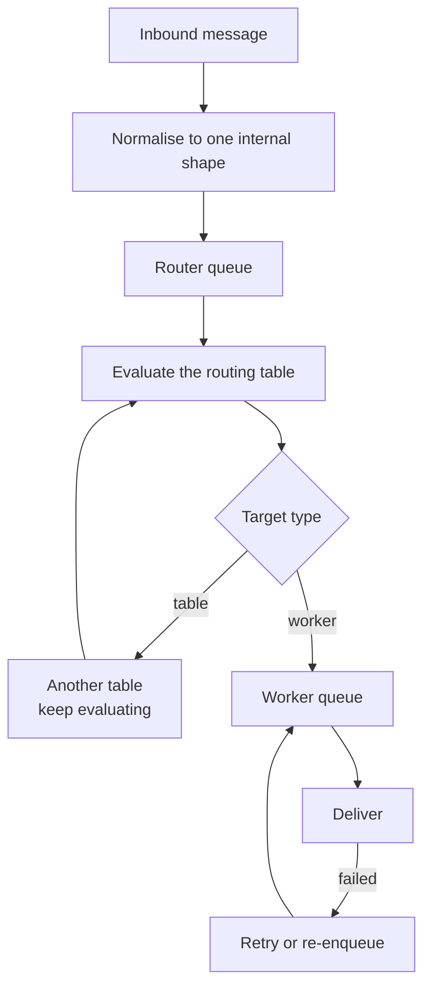

FireFlo accepts outbound messages from HTTP or from downstream SMPP clients, normalises them into one
internal shape, routes them through configurable tables, and delivers them through vendor connections
to upstream carriers.

## The two modules

| Module | Holds |
| :--- | :--- |
| `fireflo-app` | The runnable Quarkus application, Docker entry point, application properties, packaging |
| `fireflo-core` | The gateway: REST API, listeners, vendors, routing, queues, receipt tracking, configuration, webhooks |

## Runtime components

## The pipeline

Inbound protocols create one internal message and enqueue it. Router threads evaluate the routing
table and enqueue into one or more worker queues. Worker threads do the protocol-specific delivery.

<Warning>
**A message is accepted, charged and answered before it is routed.** That is what makes the gateway
fast, and it is why the queues matter: everything in them has already been paid for. Unbounded, a
vendor that stops accepting plus a listener that keeps accepting grows the heap until the JVM is
killed — and every queued message dies unrefunded and recorded as nothing but PENDING.

[Queue limits](/reference/config/limits) are how you bound that, and there is deliberately no default.
</Warning>

## Where state lives

| State | Lives in | Survives a restart |
| :--- | :--- | :--- |
| Configuration | Files, or PostgreSQL | Yes |
| Call records | PostgreSQL, or `data/cdr/` | Yes |
| Prepaid balance and ledger | PostgreSQL only | Yes |
| Receipt correlation, held receipts | `data/dlr-mvstore.db` | Yes |
| Queues, reserved credit blocks, session state | Memory | **No** |

Two of those are worth knowing precisely:

**The receipt store is the only persistent state outside PostgreSQL.** It remembers which vendor
message id belongs to which submission, and holds receipts for a client that has disconnected. See
[the store settings](/reference/config/webhooks).

**Reserved credit is in memory.** Credit is handed out to a worker in blocks and spent from a counter,
so there is no database write on the message path. A clean shutdown returns what is unspent; a
`kill -9` strands it until [`fireflo credit release`](/reference/cli/fireflo) runs. `balance + reserved`
is conserved either way.

## Both directions

FireFlo is not only an outbound gateway.

| Direction | Path |
| :--- | :--- |
| **MT out** | Customer → listener or REST → router → vendor → carrier |
| **MT in over HTTP** | Application → `/secure/send` → the same router |
| **Receipts back** | Carrier → vendor → correlation store → customer's session, or their webhook |
| **MO in** | Carrier → vendor → owner resolution → customer's session, or their webhook |

Inbound message ownership is resolved by `mo.owner.map` on the listener, and an unmapped message goes
**nowhere** rather than to a guess — see [Listener settings](/reference/smpp/server).

## What is not on the message path

The **control panel**. It edits configuration and reads call records; a panel that is down costs you
the ability to make changes, not the ability to send.

The **management port** (9000). Health, metrics and the control verbs live there, away from the port
carrying messages, behind [two separate tokens](/reference/config/operational-endpoint).
