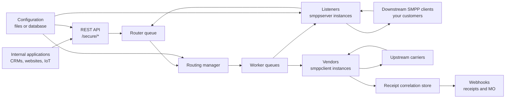
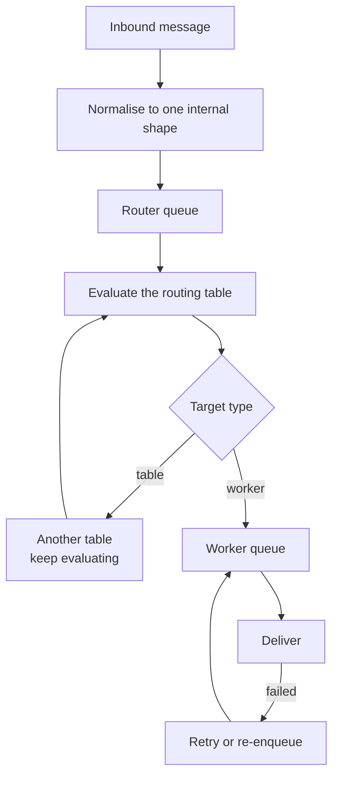

O FireFlo aceita mensagens de saída via HTTP ou de clientes SMPP downstream, normaliza-as em um
único formato interno, roteia-as através de tabelas configuráveis e as entrega através de conexões
de fornecedores para operadoras upstream.

## Os dois módulos

| Módulo | Contém |
| :--- | :--- |
| `fireflo-app` | A aplicação Quarkus executável, o ponto de entrada Docker, as propriedades da aplicação, o empacotamento |
| `fireflo-core` | O gateway: API REST, listeners, vendors, roteamento, filas, rastreamento de recibos, configuração, webhooks |

## Componentes de tempo de execução

## O pipeline

Protocolos de entrada criam uma mensagem interna única e a colocam em fila. Threads do roteador avaliam
a tabela de roteamento e enfileiram em uma ou mais filas de workers. Threads de worker fazem a
entrega específica do protocolo.

<Warning>
**Uma mensagem é aceita, cobrada e respondida antes de ser roteada.** É isso que torna o gateway
rápido, e é por isso que as filas importam: tudo o que está nelas já foi pago. Sem limites, um
vendor que para de aceitar somado a um listener que continua aceitando faz o heap crescer até que a
JVM seja finalizada. E cada mensagem enfileirada morre sem reembolso e é registrada apenas como PENDING.

Os [limites de fila](/reference/config/limits) são como você delimita isso, e propositalmente não há um valor padrão.
</Warning>

## Onde vive o estado

| Estado | Vive em | Sobrevive a um restart |
| :--- | :--- | :--- |
| Configuração | Arquivos, ou PostgreSQL | Sim |
| Call records | PostgreSQL, ou `data/cdr/` | Sim |
| Saldo pré-pago e ledger | Somente PostgreSQL | Sim |
| Correlação de recibos, recibos retidos | `data/dlr-mvstore.db` | Sim |
| Filas, blocos de crédito reservados, estado de sessão | Memória | **Não** |

Duas dessas merecem ser conhecidas com precisão:

**O receipt store é o único estado persistente fora do PostgreSQL.** Ele lembra qual message id do
vendor pertence a qual submissão, e retém recibos para um cliente que se desconectou. Veja
[as configurações do store](/reference/config/webhooks).

**O crédito reservado está em memória.** O crédito é distribuído a um worker em blocos e gasto a partir
de um contador, portanto não há gravação no banco de dados no caminho da mensagem. Um desligamento limpo
retorna o que não foi gasto; um `kill -9` deixa esse crédito preso até que [`fireflo credit release`](/reference/cli/fireflo)
seja executado. `balance + reserved` é conservado em qualquer caso.

## Ambas as direções

O FireFlo não é apenas um gateway de saída.

| Direção | Caminho |
| :--- | :--- |
| **MT out** | Cliente → listener ou REST → router → vendor → operadora |
| **MT in por HTTP** | Aplicação → `/secure/send` → o mesmo router |
| **Recibos de volta** | Operadora → vendor → correlation store → sessão do cliente, ou seu webhook |
| **MO in** | Operadora → vendor → resolução de proprietário → sessão do cliente, ou seu webhook |

A propriedade de mensagens de entrada é resolvida por `mo.owner.map` no listener, e uma mensagem sem
mapeamento vai **para lugar nenhum** em vez de para um palpite. Veja [Configurações do Listener](/reference/smpp/server).

## O que não está no caminho da mensagem

O **painel de controle**. Ele edita configuração e lê call records; um painel fora do ar custa a você
a capacidade de fazer alterações, não a capacidade de enviar.

A **porta de gerenciamento** (9000). Health, métricas e os verbos de controle vivem ali, longe da porta
que carrega mensagens, atrás de [dois tokens separados](/reference/config/operational-endpoint).
